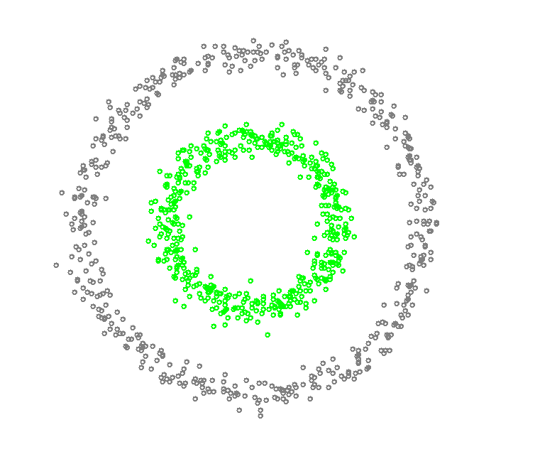
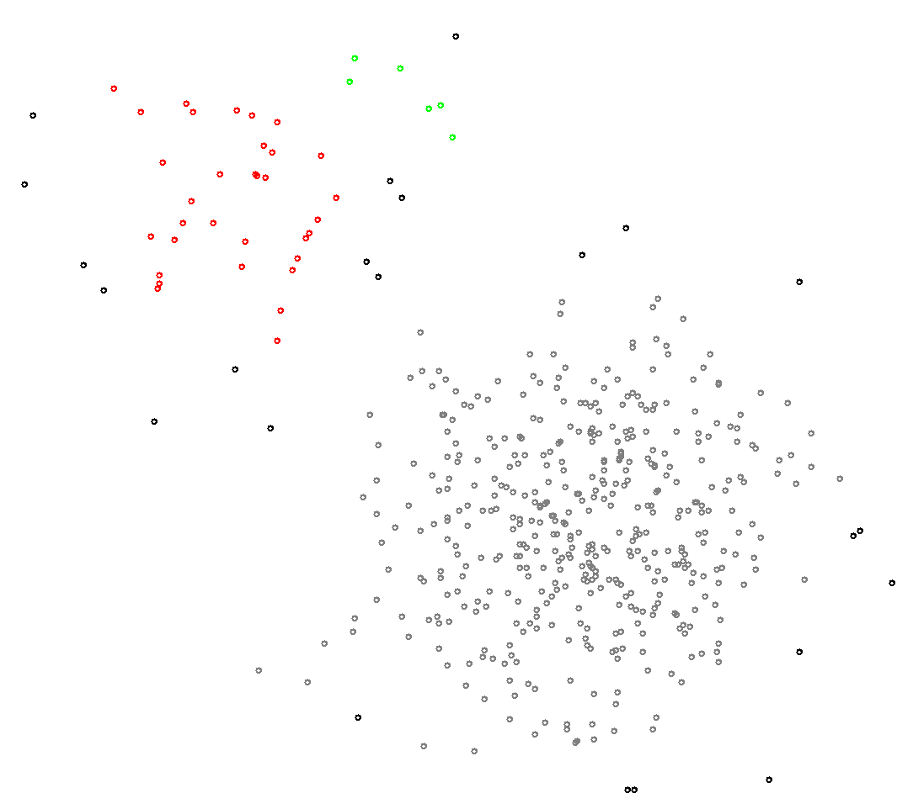

####DBSCAN clustering

Compare to the K-means algorithm, this is a density-based clustering algorithm, which means it can deal with datasets with any shape. And it can also detect noise points. Good for data which contains clusters of similar density.

parameters:
  * eps: The maximum distance between two samples for them to be considered as in the same neighborhood.
  * minpts: The number of samples in a neighborhood for a point to be considered as a core point.

Pseudocode from wiki:

        DBSCAN(D, eps, MinPts)
           C = 0
           for each unvisited point P in dataset D
              mark P as visited
              NeighborPts = regionQuery(P, eps)
              if sizeof(NeighborPts) < MinPts
                 mark P as NOISE
              else
                 C = next cluster
                 expandCluster(P, NeighborPts, C, eps, MinPts)
                  
        expandCluster(P, NeighborPts, C, eps, MinPts)
           add P to cluster C
           for each point P' in NeighborPts 
              if P' is not visited
                 mark P' as visited
                 NeighborPts' = regionQuery(P', eps)
                 if sizeof(NeighborPts') >= MinPts
                    NeighborPts = NeighborPts joined with NeighborPts'
              if P' is not yet member of any cluster
                 add P' to cluster C
                  
        regionQuery(P, eps)
           return all points within P's eps-neighborhood (including P)

Properties of DBSCAN algorithm:
  * No need to specify number of clusters
  * Two parameters needs to be tuned

#####Examples
 succeed
 failed

[Java code](src/DBSCAN/DBScan.java)
