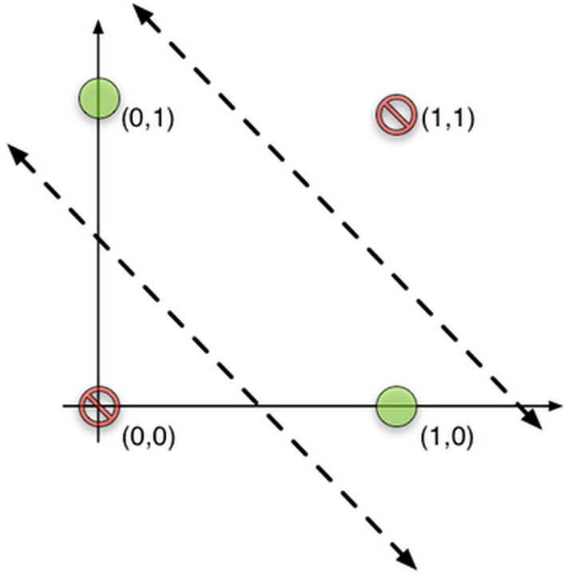

####Neural Networks

#####Perceptrons
* a set of weight inputs for featurs
* an add to sum the input signals
* an activation function: could be a threshold or sigmoid function.

Algorithm:

1. initializing
  * set all of the weights to small random numbers
2. training
  * repeat until all outputs are correct: 
    * for each input
      1. compute activation
      2. update each weight
3. compute the activation again

However, single perception modle cannot handle the case when classes are linearly inseparable. So we build a multi-layer perceptron.

#####Multi-layer Perceptrons

* Every perceptron is a simple binary classifier that separate output space to two class(negative and positive).
* By combine output of feature we can produce new "features", which means more accurate decision boundaries for the output space.
* All layers together general function approximators.

Take XOR as an example:

