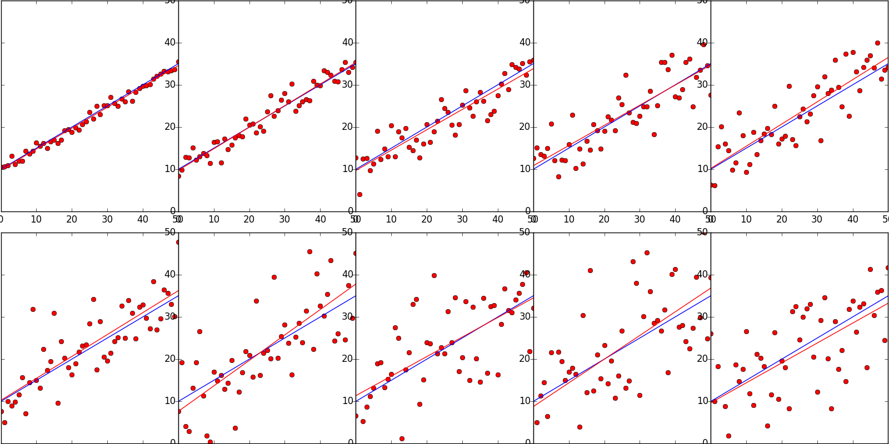

####Simple Linear Regression
Simple linear regression is to predict a __quantitative__ Y given a single input X.
We can use a linear model to describe the relationship
```
y = A + Bx
```
we can estimate the coefficients A and B by minimize the __residual sum of squares(RSS)__.

Residual is the difference bewteen observed value and predict value.RSS is the sum of all squared residual.

This is an example of simple linear regression. Blue line is actual equation. Red point are generated from the blue line with increasing variance, and the red line is the predicting equation. We can see that it works well.



[Python code](src/Regression/SimpleLeastSquare.py)
