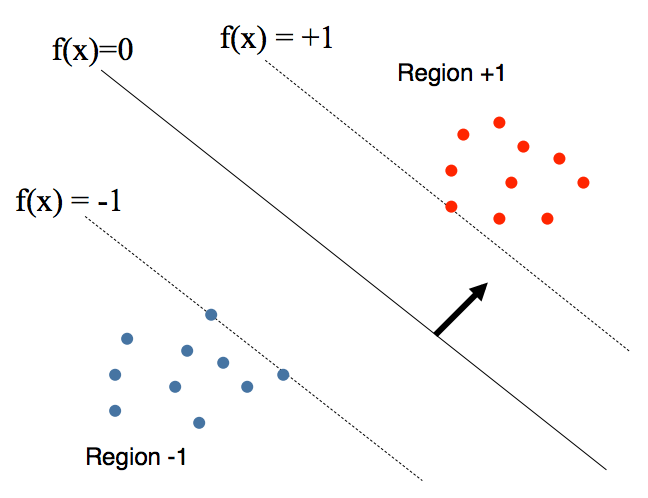
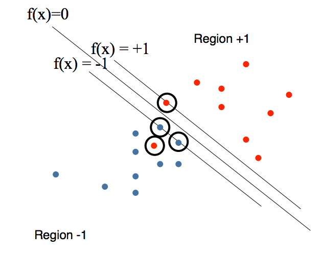

####Support	vector	machines	

#####"Large	margin"	for	separable	data	

* Primal quadratic programming:	maximize	margin	subject	to	linear	constraints	
  
  

* Lagrangian	optimization

  We can find the optimal setting of the Lagrange multipliers by maximizing

   suject to each alpha in [0,C]

  * larger C means larger penalty for errors
  * alpha = 0 except for “support vectors”
  * all misclassified examples will be support vectors

* We make predictions according to the sigh of the discriminant function

#####"Soft margin"	for	non-separable	data	

* Primal form: regularized	hinge	loss	
  * The objective function is increased by a function which penalizes non-zero factor, and the optimization becomes a trade off between a large margin and a small error penalty 
* Dual	form:	m-dimensional	quadratic programming 

#####Kernels	
  * We can apply kernal funtions to project the function to a higher space to make the classes linearly separable.
  * Dual	form	involves	only	pairwise	similarity	
